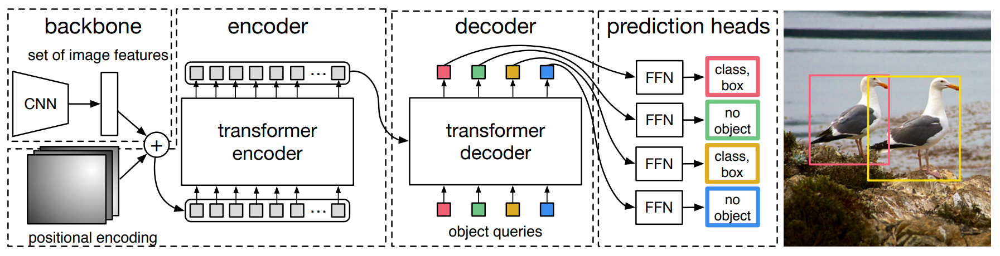

# [DE⫶TR: End-to-End Object Detection with Transformers](https://ai.facebook.com/research/publications/end-to-end-object-detection-with-transformers)
Facebook AI : Nicolas Carion, Francisco Massa, Gabriel Synnaeve, Nicolas Usunier, and Alexander Kirillov



This repo shows a quick demo of how to use DETR for prediction on custom dataset. DETR combines a CNN with a transformer architecture to predict a set of detections. It uses *bipartite matching* to uniquely assign predictions with ground-truth bounding-boxes. This is the current state-of-the-art in 2D object detection and does not require hand-engineered components usch as anchor boxes, and non-max suppression. The self-attention mechanism of transformer models all pairwise interactions between elements in a sequence which helps the network establish relationship between different parts of the image such as head, tail, and legs; and at the same time distinguish between objects. It works really well with occluded objects and the visualization of attention maps has proven that the network learn to separate instances pretty clearly.

DETR model and pretrained weights can be downloaded from PyTorch hub and is very easy to put to work. Please see ```demo.py``` for an example on how to use this model for object detection on a custom dataset. Prediction results of DETR on **nuScenes**, and **KITTI raw** dataset are shown below.  

